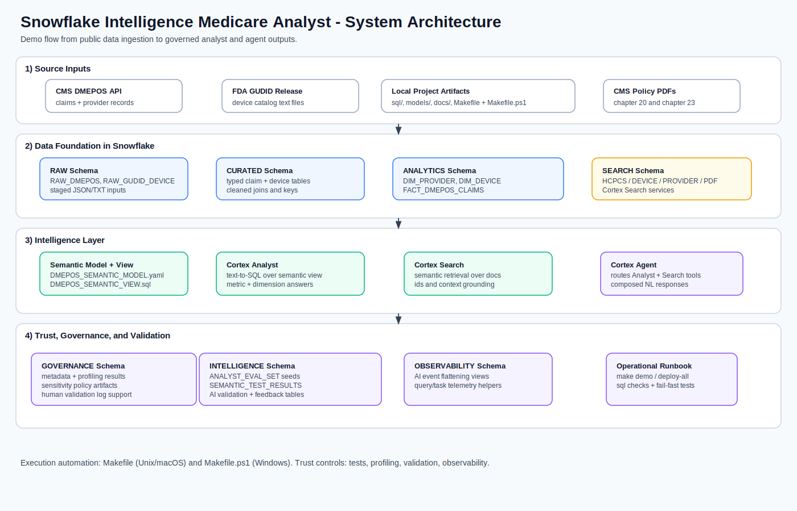
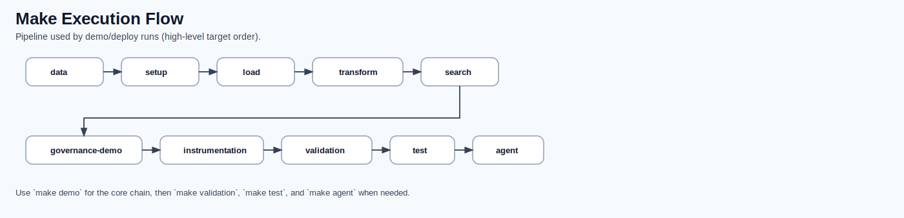
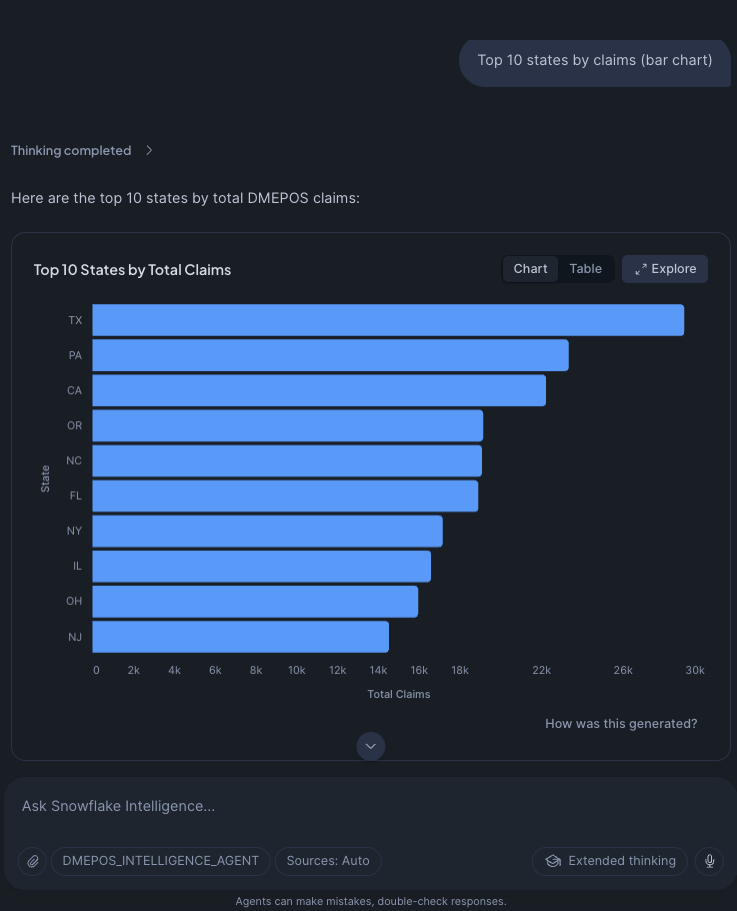

# Snowflake Intelligence Medicare POS Analyst

A hands-on Snowflake Intelligence learning repo using Medicare DMEPOS data.

What you get:
- End-to-end SQL pipeline (ingestion, transform, search, governance).
- Semantic model + semantic view for Cortex Analyst.
- Cortex Search across HCPCS, devices (GUDID), providers, and CMS PDFs.
- Cortex Agent orchestration with validation + observability trust layer.

## System Architecture



## Quick Run

```bash
make data
make demo
# optional: rerun semantic regression checks only
make test
```

`make search` can take a few minutes while Cortex Search indexing/embeddings initialize.

## Prerequisites

- Snowflake account with Cortex Search and Snowflake Intelligence enabled.
- Snowsight access.
- Snowflake CLI installed (`snow --version`). Make targets use `snow sql`.
- SnowSQL is optional for manual script execution.
- One-time admin access to run `make observability-bootstrap` (or equivalent pre-granted observability permissions).

## One-time CLI Setup

The Makefile defaults to Snowflake CLI connection name `sf_int`.

```bash
snow connection add sf_int
snow connection test -c sf_int
```

If you prefer another connection name:

```bash
make SNOW_OPTS="sql -c <your_connection_name>" demo
```

## Windows Equivalent

Windows can use `make` if installed (for example via Chocolatey, Scoop, Git Bash, or WSL), but it is not available by default.

This repo includes a PowerShell equivalent runner:

```powershell
.\Makefile.ps1 help
.\Makefile.ps1 demo
.\Makefile.ps1 deploy-all
```

Connection override:

```powershell
.\Makefile.ps1 demo -Connection <your_connection_name>
```

## Quickstart

Optional: run everything with a single command after setting your Snow CLI connection:

```bash
# Example: export PRIVATE_KEY_PASSPHRASE="<your passphrase>"
make demo
```

### Make Execution Flow



The Makefile uses [`sql/ingestion/stage_raw_files.sql`](sql/ingestion/stage_raw_files.sql) for `PUT` uploads from [`data/`](data/).
If your files are stored in a different local path, update `PUT` paths in [`sql/ingestion/stage_raw_files.sql`](sql/ingestion/stage_raw_files.sql).

1. Create roles, warehouse, database, and schema using [`sql/setup/setup_user_and_roles.sql`](sql/setup/setup_user_and_roles.sql).

Update `target_user` before running.

2. Download source data:

```bash
python data/dmepos_referring_provider_download.py --max-rows 1000000
bash data/data_download.sh
```

3. Upload raw files to Snowflake stages:

```bash
make stage-raw
```

`make load` also runs `stage-raw` automatically. Run `make data` first so local files exist.

4. Build the curated tables and views using [`sql/transform/build_curated_model.sql`](sql/transform/build_curated_model.sql).

5. Create Cortex Search services:
- [`sql/search/cortex_search_hcpcs.sql`](sql/search/cortex_search_hcpcs.sql)
- [`sql/search/cortex_search_devices.sql`](sql/search/cortex_search_devices.sql)
- [`sql/search/cortex_search_providers.sql`](sql/search/cortex_search_providers.sql)
- [`sql/search/cortex_search_pdf.sql`](sql/search/cortex_search_pdf.sql)

`make search` now creates all four services, prepares `SEARCH.PDF_STAGE`, and auto-uploads local files from [`pdf/cms_manuals/`](pdf/cms_manuals/) when present.

Note: search service creation can take a few minutes while indexing initializes. Let the make run continue.

6. Create instrumentation and seed eval prompts:
- [`sql/intelligence/instrumentation.sql`](sql/intelligence/instrumentation.sql)
- [`sql/intelligence/eval_seed.sql`](sql/intelligence/eval_seed.sql)

7. Create metadata and quality scaffolding (optional but recommended) using [`sql/governance/metadata_and_quality.sql`](sql/governance/metadata_and_quality.sql).

8. Create semantic view used by the SQL-defined Cortex Agent:

```bash
make semantic-view
```

9. Create observability trust-layer objects:

```bash
# one-time environment bootstrap (admin role)
make observability-bootstrap

# normal runtime flow
make observability
```

10. (Optional) Create the Cortex Agent:

- SQL path: [`sql/agent/cortex_agent.sql`](sql/agent/cortex_agent.sql)
- Analyst resource: `MEDICARE_POS_DB.ANALYTICS.DMEPOS_SEMANTIC_MODEL` (semantic view)
- UI guide: [`sql/agent/build_agent.md`](sql/agent/build_agent.md)
- `make agent` now ensures semantic view + search services are created first.

`make demo` and `make deploy` include observability object creation in the default flow.
Run `make observability-bootstrap` once per environment before the first demo run.

Optional Snowsight UI path (not required for `make agent`):

- Upload [`models/DMEPOS_SEMANTIC_MODEL.yaml`](models/DMEPOS_SEMANTIC_MODEL.yaml) to:
  `@MEDICARE_POS_DB.ANALYTICS.CORTEX_SEM_MODEL_STG/DMEPOS_SEMANTIC_MODEL.yaml`
- Then follow [`docs/implementation/snowflake_intelligence_setup.md`](docs/implementation/snowflake_intelligence_setup.md).

## Demo prompts

- "Top 10 states by claim volume"
- "What is HCPCS code E1390?"
- "Find oxygen concentrators"
- "Find endocrinologists in California"

Demo output sample:


- [SF Intelligence Questions Demo](https://youtu.be/oDwzBjjOXGE)
- [Snowflake Intelligence Cortex Analyst and Search Routing](https://youtu.be/QUHcTTWpJYI)
- [SF Intelligence Overview Demo](https://youtu.be/4JZUa86I3hM)

## Repository layout

- [`sql/`](sql/) - Setup, ingestion, transform, search, governance, observability, and intelligence SQL.
- [`models/`](models/) - Semantic model and semantic view artifacts.
- [`data/`](data/) - Download helpers (raw data is gitignored).
- [`docs/`](docs/) - Documentation and diagrams.

## Medium Series

- [Hub Article](https://medium.com/p/c95edd83402e/edit)
- [Part 1: Context Engineering](https://medium.com/p/c95edd83402e/edit)
- [Part 2: Data Architecture](https://medium.com/p/ccdd6700bad8/edit)
- [Part 3: Trust Layer](https://medium.com/p/7665aebb624f/edit)

## Docs highlights

- [`docs/README.md`](docs/README.md) - Doc hub with navigation.
- [`docs/implementation/getting-started.md`](docs/implementation/getting-started.md) - Step-by-step deployment guide.
- [`docs/implementation/data_model.md`](docs/implementation/data_model.md) - Data model and schema design.
- [`docs/implementation/snowflake_intelligence_setup.md`](docs/implementation/snowflake_intelligence_setup.md) - Optional Snowsight source setup.
- [`docs/governance/data_dictionary.md`](docs/governance/data_dictionary.md) - Data definitions and classifications.
- [`docs/reference/semantic_model_guide.md`](docs/reference/semantic_model_guide.md) - Semantic model design details.
- [`docs/reference/semantic_view_guide.md`](docs/reference/semantic_view_guide.md) - YAML -> semantic view workflow.
- [`docs/reference/cortex_agent_creation.md`](docs/reference/cortex_agent_creation.md) - Agent setup and tool mapping.
- [`docs/reference/demo_queries.md`](docs/reference/demo_queries.md) - Compact demo query matrix.
- [`docs/trust_layer/trust_layer_architecture.md`](docs/trust_layer/trust_layer_architecture.md) - Advanced trust-layer and observability architecture.
- [`sql/observability/README.md`](sql/observability/README.md) - Observability runbook for flattening AI events into governance records.

## License

This project is licensed under the MIT License. See [`LICENSE`](LICENSE).
